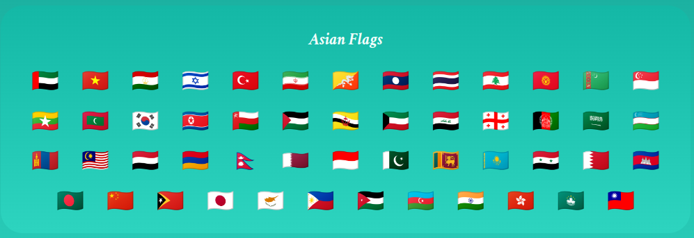

# Flags Of Asia

## Made Using HTML, CSS and REACT

Do you face troubles identifying flags of countries? Well, I do and that's why I built this web-app that can help me identify flags of the countries that belong to Asia and tell me their names as well!

It's easy to use the app. You can input a flag yourself in the **input field** and the output field will automatically display whether that flag belongs to Asia or not. And if it does, then it will also display the name of that country.

There is a small library of flags just below the output field. It contains all the flags of the countries that belongs to Asia. You can click on any of the given flags and the output field will show the name of the country that flag belongs to.

You can refer to the images below to understand the web-app better.

1. Input Field

2. Output Field

3. Flag Library

***
#### HAVE FUN IDENTIFYING SOME FLAGS!
